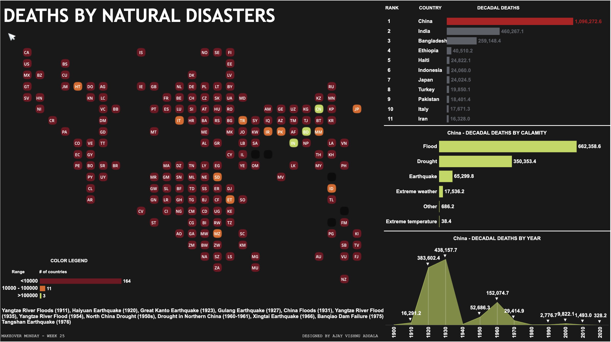

# Natural Calamities Deaths Dashboard

This repository contains data and a Tableau dashboard for the Makeover Monday challenge focused on deaths due to natural calamities worldwide from 1900 to 2020.

## Dashboard Overview

The Tableau dashboard visualizes the following aspects:

- **Tile Map**: Displays countries color-coded based on the count of natural calamity deaths. Hovering over a country shows decadal deaths.
- **Rank Chart**: Shows the rank of the selected country and dynamically updates to display ranks of neighboring countries.
- **Calamity Breakdown**: Displays decadal deaths categorized by different natural calamities (floods, earthquakes, droughts, etc.).
- **Decadal Trend**: Illustrates the trend of deaths by decade for the selected country.

For countries with total decadal deaths exceeding 10,000, additional details such as specific calamities and years are shown below the rank chart.

## Tableau Public Link

[View the interactive dashboard on Tableau Public](https://public.tableau.com/views/DeathsbyNaturalDisastersMOM2024Week25/Dashboard?:language=en-US&:sid=&:display_count=n&:origin=viz_share_link)

## Files

- Contains the dataset used for analysis.
- Tableau packaged workbook file containing the dashboard configuration.
- This readme file provides an overview of the project.
